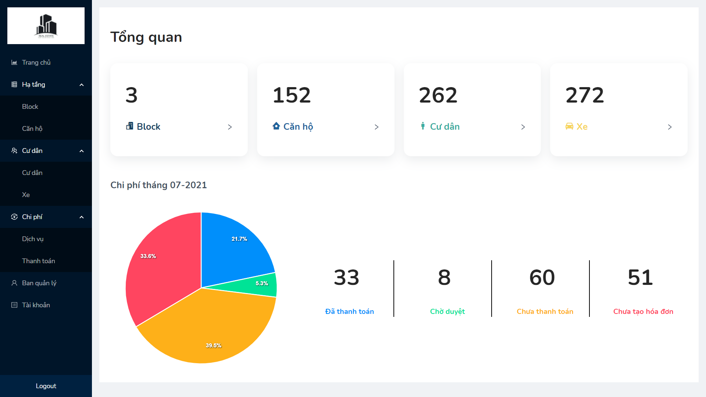

# Ứng dụng Sổ tay chung cư

- Hiện nay, với nhu cầu nhà ở ngày càng tăng, các khu chung cư liên tục được hình thành với mật độ, quy mô vô cùng lớn và trở thành địa điểm “an cư lạc nghiệp” của rất nhiều đối tượng khách hàng. 

- Tuy nhiên, với mật độ sinh sống của mỗi khu chung cư từ 100-200 căn hộ/ tòa chung cư thì vấn đề nan giải đặt ra cho các nhà quản lý là làm sao có thể quản lý tốt tòa nhà, để đảm bảo quyền lợi của dân cư, nắm rõ tình trạng của tòa nhà, từ đó đưa ra các giải pháp hiệu quả và kịp thời. 
  
- Mặt khác với những cư dân sinh sống trong các khu chung cư thì có nhu cầu tra cứu thông tin, để có phương thức liên lạc hiệu quả với BQL kịp thời - chính xác, cũng như thanh toán các phí dịch vụ một cách nhanh chóng thuận tiện, không bị giới hạn thời gian      

Ứng dụng **Sổ tay chung cư** được tạo ra nhằm giải quyết các nhu cầu trên cho ban quản lý cũng cư dân của một chung cư vừa và nhỏ

## Nội dung
1. [Live demo](#live-demo)

1. [Chức năng](#chức-năng)

   1. [Đăng nhập](#đăng-nhập)
   
   1. [Dashboard](#dashboard)

   1. [Quản lý Block](#quản-lý-block)
   
   1. [Quản lý Căn hộ](#quản-lý-căn-hộ)
   
   1. [Quản lý Cư dân](#quản-lý-cư-dân)

   1. [Quản lý Xe](#quản-lý-xe)
   
   1. [Quản lý Dịch vụ](#quản-lý-dịch-vụ)

   1. [Quản lý Chi phí](#quản-lý-chi-phí)

   1. [Quản lý Chi phí](#quản-lý-chi-phí)

1. [Thư viện và công nghệ](#thư-viện-và-công-nghệ)

1. [Tác giả](#tác-giả)


## Live Demo
-  Live demo Web: [Apartment-Handbook](https://kltn-17521236.vercel.app/)
-  Live demo Mobile app (F12 để xem dưới dạng mobile): [Apartment-Handbook-Mobile](https://kltn-mobile.vercel.app/)
-  Backend: [Task Manager Server](https://github.com/17521236/KLTN-Backend)

## Cài đặt

Use the package manager [npm](https://www.npmjs.com/) to install and run.

```bash
npm install
npm start
```

## Chức năng
### Đăng nhập
   * Đăng nhập
   <p align="center">
   
   </p>

    
### Dashboard
   * Dashboard
   <p align="center">
   
   </p>

   
### Quản lý Block
   * Danh sách Block   
   <p align="center">
   
   </p>

   * Thêm mới Block
   <p align="center">
   
   </p>

   * Xem, Sửa Block
   <p align="center">
   
   </p>  
    
### Quản lý Căn hộ
   * Danh sách Căn hộ   
   <p align="center">
   
   </p>

   * Thêm mới Căn hộ
   <p align="center">
   
   </p>

   * Xem, Sửa Căn hộ
   <p align="center">
   
   </p>

### Quản lý Cư dân
   * Danh sách Cư dân   
   <p align="center">
   
   </p>

   * Thêm mới Cư dân
   <p align="center">
   
   </p>

   * Xem, Sửa Cư dân
   <p align="center">
   
   </p>
   <p align="center">
   
   </p>

### Quản lý Xe
   * Danh sách Xe   
   <p align="center">
   
   </p>

   * Thêm mới Xe
   <p align="center">
   
   </p>

   * Xem, Sửa Xe
   <p align="center">
   
   </p>

### Quản lý Dịch vụ
   * Danh sách Dịch vụ
   <p alig="center">
   
   </p>

   * Xem, Sửa giá thành Dịch vụ
   <p align="center">
   
   </p>

### Quản lý Chi phí
   * Danh sách Chi phí   
   <p align="center">
   
   </p>

   * Thêm mới Chi phí
   <p align="center">
   
   </p>

   * Xem Chi phí
   <p align="center">
   
   </p>

   * Xác nhận thanh toán Chi phí
   <p align="center">
   
   </p>

### Quản lý Tài khoản
   * Danh sách Tài khoản
   <p align="center">
   
   </p>

   * Thêm mới Tài khoản
   <p align="center">
   
   </p>

   * Xem, Sửa Tài khoản
   <p align="center">
   
   </p>


## Yêu cầu thiết bị
- Not support:

   + IE-10

## Thư viện và công nghệ

- Language : Typescript, Javascript, HTML, SCSS

- FrameWork : Angular, Nodejs, Express

- Database: MongoDB

   <p align="center">
   
   </p>


## Tác giả

- Nguyễn Mạnh Tùng - 17521236@gm.uit.edu.vn

- Cán bộ hướng dẫn: ThS. Huỳnh Nguyễn Khắc Huy

- Cán bộ phản biện: ThS. Huỳnh Tuấn Anh

